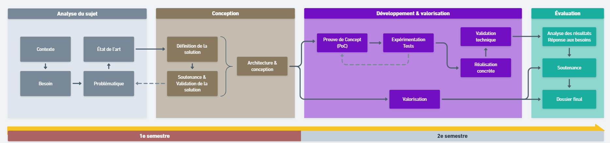
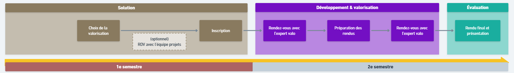
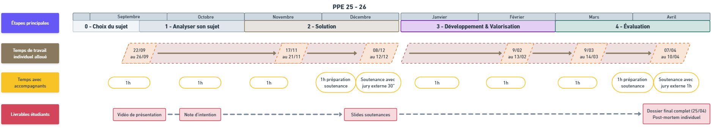

#  Prototype d’Outil d’Émulation d’un Adversaire IoT — PPE ING4-Cyber

## 📌 Description
Ce projet consiste à développer un **prototype d’outil capable de simuler le comportement d’un adversaire ciblant des dispositifs IoT** (Internet des Objets).  
L’objectif est de reproduire différents scénarios d’attaques (intrusions, manipulations de données, dénis de service, compromission de capteurs, etc.) dans un environnement **contrôlé et reproductible**, afin d’évaluer la **résilience, la sécurité et la robustesse** des systèmes IoT.  

Cet outil s’adresse aux **chercheurs** et **professionnels de la cybersécurité** pour :
- tester des contre-mesures,
- entraîner et valider des mécanismes de détection,
- renforcer la protection des infrastructures connectées.

Projet réalisé dans le cadre du **PPE (Projet Pluridisciplinaire en Équipe)** à l’**ECE Paris** en majeure **Cyber & Data**.

---

## 🎯 Objectifs
- Développer un **émulateur d’attaques IoT** modulable et extensible.
- Proposer une **plateforme de simulation** pour différents scénarios :  
  - reconnaissance réseau,  
  - injection de données,  
  - replay attack,  
  - déni de service,  
  - compromission de capteurs et passerelles.  
- Intégrer un **pipeline de détection et visualisation** des anomalies.
- Garantir un cadre **éthique et sécurisé** pour l’expérimentation.

---

##  Équipe & Collaboration
Projet mené par une **équipe pluridisciplinaire d’étudiants** en :
- Cybersécurité offensive & défensive,  
- Réseaux IoT,  
- Analyse de données & Intelligence Artificielle.  

Méthodologie : **Agile (Scrum/Kanban)** avec sprints, suivi régulier et validation par le coach référent.

---

##  Planning (6+ mois)

---

##  Contraintes Éthiques & Réglementaires
- **Usage strictement académique et expérimental** (lab fermé, réseau isolé).  
- Respect du **cadre légal** (aucune attaque sur des infrastructures réelles ou publiques).  
- Mise en place de procédures d’arrêt d’urgence (kill-switch).  
- Documentation claire sur les **limites d’utilisation** et le périmètre autorisé.

---

##  Valorisation & Communication
- Documentation technique et pédagogique.  
- Démonstrations lors des soutenances PPE.  
- Publication possible de jeux de données (logs anonymisés).  
- Perspectives d’extension : intégration dans des plateformes de **cyber range IoT**.

